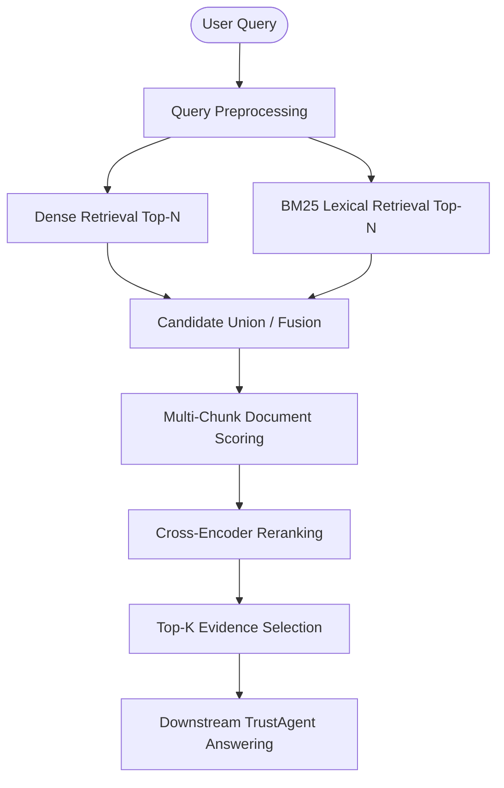

# TrustAgent Architecture

TrustAgent's architecture is a modular, neuro-symbolic system that merges generative AI flexibility with deterministic logical validation. This document details the conceptual pipelines that drive both the core TrustAgent product and its experimental retrieval systems.

---

## 1. High-Level Core Architecture (CURRENT)

The primary TrustAgent application handles complex document workflows (like auditing contracts or invoices). It operates via a frontend Next.js interface and a FastAPI backend orchestrating LangGraph agents.

```mermaid
flowchart TD
    User([User]) --> API[TrustAgent API / Frontend]
    API --> QP[Query Processing & Intent Classification]
    
    QP --> Agents[Agent Swarm (Document, Tax, Legal)]
    
    Agents <--> RAG[Legal RAG Layer / ChromaDB]
    
    Agents --> Forensics[Forensics Module]
    Forensics <--> Z3[Z3 Theorem Prover Engine]
    
    Forensics --> Decision[Decision / Output Layer]
    Decision --> User
```

### Components
- **Query Processing:** Analyzes user input to determine if the task requires legal lookup, math validation, or general text analysis.
- **Agent Swarm:** Specialized LLM agents orchestrate the workflow.
- **Legal RAG Layer:** Connects to the local, production ChromaDB (`Backend/rag/chroma_db`) to fetch relevant legal clauses.
- **Forensics / Z3 Engine:** The "gatekeeper." If the LLM proposes a tax calculation or a contractual condition, this layer translates the rules into mathematical constraints and formally verifies them using Z3.

---

## 2. Information Retrieval (IR) Pipeline (REUSABLE ENGINEERING)

During intensive engineering phases (such as the UIT DSC 2026 period), TrustAgent's retrieval mechanics were significantly upgraded. While specific datasets and models from those phases are excluded, the **reusable architectural concepts** remain supported by the codebase in `Backend/scripts/`.

### Conceptual Retrieval Flow



### Pipeline Stages

1. **Query Preprocessing:** Normalizes the input query, applying prefixes where necessary to align with the specific embedding model's training distribution.
2. **Dual-Encoder Dense Retrieval:** Converts the query to a dense vector and performs an approximate nearest neighbor search (via FAISS or Chroma) against pre-computed document embeddings.
3. **Sparse Lexical Retrieval (BM25):** Executes traditional inverted-index term matching to capture exact keywords and entity names that dense models might miss.
4. **Candidate Union:** Merges the candidate sets from both dense and sparse retrieval, ensuring high recall.
5. **Multi-Chunk Document Scoring:** Because legal documents are long, they are often split into smaller chunks. This stage aggregates chunk-level similarities (using methods like `MAX`, `TOP2AVG`, or `TOP5AVG`) to assign a single confidence score to the parent document.
6. **Cross-Encoder Reranking:** A secondary, heavier model evaluates query-document pairs simultaneously (e.g., using a pointwise BCE objective) to provide a highly accurate final score.
7. **Rank Fusion / Selection:** Final deduplication and selection of the Top-K passages to be injected into the LLM context window.

---

## 3. Extending the Architecture (FUTURE)

Future extensions to the TrustAgent repository should adhere to this modular philosophy:
- **New Agents:** Implement new LangGraph agents in `Backend/agents/` without disrupting the Forensics gatekeeper.
- **Retrieval Upgrades:** Integrate new embedding models or dense retrieval strategies into the IR pipeline (`pipelines/retrieval/` and `Backend/rag/`), maintaining the clear separation between candidate generation and reranking.

---

## 4. Engineering Lessons Learned (Historical Context)

The intensive engineering effort during the IR pipeline upgrades yielded several critical architectural lessons for TrustAgent:

1. **Candidate Coverage vs. Final Ranking:** Generating candidates and ranking them are fundamentally different problems. More retrieval coverage does not automatically result in a better final `Recall@K` if the reranker struggles to discriminate among the added noise.
2. **Rank Fusion Complexities:** Combining scores from multiple retrieval systems (Rank Fusion) can sometimes degrade performance if the score distributions are not carefully normalized.
3. **Cross-Encoder Context:** A cross-encoder's quality is highly dependent on the candidate pool it was trained on. It must be evaluated on the *exact same* candidate pool generation method used in production.
4. **Multi-Chunk Trade-offs:** While averaging the top chunks (`TOP3AVG`) smooths out anomalies, simple `MAX` scoring often performs better for needle-in-a-haystack legal queries.
5. **Leakage Prevention is Paramount:** Validation sets must be rigorously insulated from training data, particularly when utilizing hard-negative mining, to prevent inflated offline metrics.
6. **Resource-Aware Inference:** On systems with limited VRAM, carefully orchestrating model loading, unloading, and precision types (FP16) is just as critical as algorithmic improvements.
7. **Schema Validation:** Enforcing strict schema validation on output artifacts prevents catastrophic system failures downstream.
